# Week 3: Mathematical Models – Parameters, Functions, and Growth  

## Introduction

Mathematical models are **purposeful simplifications** of real-world systems. They distill complex environmental processes—like population change, heat transfer, carbon cycling, or pollutant transport—into a small set of variables, parameters, and rules. By translating mechanisms into equations or algorithms, models help us **forecast** likely futures, **analyze** drivers and feedbacks, and **make decisions** when data are limited or stakes are high.

A good model balances **clarity and realism**. It should be simple enough to understand and compute, yet detailed enough to capture the processes that matter for the question at hand. Importantly, every model is conditional: its outputs reflect its **assumptions**, **inputs**, and **uncertainties**. Rather than delivering “truth,” models provide **structured what-ifs**—evidence-based scenarios that inform conservation planning, risk assessment, and policy.

In this chapter we will:

- **Name the parts** of a model (variables, parameters, functions, initial/boundary conditions) and explain what each does.  
- **Compare growth forms** (linear, exponential, logistic, decay, thresholds) and match them to ecological stories.  
- **Fit models to data** and interpret parameters (e.g., growth rate \(r\), carrying capacity \(K\)) with attention to error and uncertainty.  
- **Test end-cases** and sensitivity to identify which assumptions/parameters drive outcomes.  
- **Connect to decisions**, using scenarios to explore management options and communicate uncertainty clearly.  

By the end, you should be able to look at an environmental problem, **choose an appropriate model form**, **justify its assumptions**, **estimate its key parameters**, and **use it responsibly** to support real-world decisions.

---

### What is a Mathematical Model?  

A mathematical model is a framework that encodes assumptions about how a system changes using symbols, functions, and relationships. Within a model, **variables** represent system states that change over time or space, such as population size \(P(t)\), pollutant concentration \(C(x,t)\), or temperature \(T(t)\). These variables are influenced by **parameters**, which are fixed values that shape system behavior—for example, the growth rate \(r\), the decay constant \(\lambda\), or the carrying capacity \(K\). 

To anchor the model, we specify **initial conditions** that describe the system at the starting point (e.g., \(P(0) = P_0\)) and **boundary conditions** that define how the system interacts with its environment, such as pollutant inputs at the upstream end of a river. The dynamics of the system are then expressed through **equations**, whether algebraic, difference, or differential, that link variables and parameters together. Depending on the purpose and data available, models can take many forms: mechanistic or physically based models grounded in process understanding, statistically based models built from data patterns, probability-based models that capture randomness, or hybrids that combine multiple approaches.  

---

### Why Models Matter in Environmental Science  

Environmental systems are complex, operate across multiple scales, and are often studied with limited or imperfect data. Because of this, intuition alone is rarely enough to guide effective decision-making. Mathematical models provide a structured way to translate ecological processes, observations, and hypotheses into a form that can be tested, refined, and applied. They act as a bridge between raw data and actionable insight.  

Models help us to:  

- **Explain** assumptions about processes. For example, a snowmelt model can explicitly represent how warming temperatures drive runoff timing, making clear what processes are assumed to matter most.  
- **Forecast** future states under different scenarios. With population models, we can project whether an endangered species will recover or decline under various management strategies.  
- **Diagnose** key drivers and feedbacks. Climate-carbon cycle models, for instance, allow us to separate the influence of emissions, land-use change, and natural sinks in shaping atmospheric CO₂ levels.  
- **Design & Manage** interventions. Harvest models can reveal what fishing quotas are sustainable, while restoration models can test whether habitat improvements are sufficient to support species recovery.  
- **Quantify uncertainty** and communicate confidence. No prediction is perfect, but models allow us to show a range of outcomes—helping managers and policymakers make informed decisions even when data are limited.  

::: promptbox
**Decision Contexts**  

- *Regulation*: Will pollutant concentrations in a river exceed safe drinking-water thresholds under typical or extreme flow conditions?  
- *Conservation*: What harvest rate or protected-area size will keep a fish population near its target biomass while still allowing human use?  
- *Climate adaptation*: How might different greenhouse gas emissions scenarios affect the number of extreme-heat days in a city, and what does this imply for public health planning?  
- *Restoration*: If wetlands are reconnected to a floodplain, how long will it take for bird populations to rebound, and what level of uncertainty surrounds that estimate?  
:::  

In short, models matter because they provide a **laboratory for ideas**—a place where scientists and decision-makers can explore “what if” questions, test assumptions, and evaluate possible futures before they unfold in the real world.

---

### The Balance Between Simplification and Realism  

When building a mathematical model, one of the most important choices is how much detail to include. Every model is a simplification of reality, but the degree of simplification can make the difference between a model that is clear and useful, and one that is either too crude to be informative or too complicated to be tractable.  

- **Simplification benefits**  
  Simplified models strip away many of the messy details of real-world systems in order to focus on core dynamics. Because they involve fewer parameters, they are easier to build with limited data, faster to compute, and easier to explain to diverse audiences. For instance, an exponential growth equation can help illustrate why invasive species may spread rapidly, even if it does not capture every factor influencing their establishment.  

- **Realism benefits**  
  More realistic models incorporate mechanisms, thresholds, or feedbacks that can matter in specific contexts. They may include spatial variation, seasonality, or nonlinear processes that strongly affect system outcomes. Realistic models can therefore give more accurate predictions for particular systems, especially when management or policy depends on fine-scale details.  

- **Trade-offs**  
  Every choice involves a trade-off. A model that is too simple risks **underfitting**—failing to capture critical dynamics. A model that is too complex risks **overfitting**—matching noise in the data rather than true processes. More detailed models also require more data and can be more sensitive to parameter uncertainty. Striking the right balance means aligning the model with the purpose: is it meant for teaching a concept, exploring scenarios broadly, or providing site-specific policy advice?  

**Example.** Consider modeling the population of salmon in a river system. A simplified logistic growth model may capture the overall idea that the population grows quickly at first and then levels off at a carrying capacity due to limited habitat. This is useful for teaching and for exploring general harvest rules. But for management decisions about a particular salmon run, a more realistic model may be needed—one that accounts for age structure, seasonal migration, water temperature, and spawning habitat availability. The simple model is easier to communicate and requires fewer data, while the realistic model is harder to build but can give more reliable forecasts for that river system.  

**Common Pitfalls** 

- Treating model outputs as absolute facts instead of scenario-conditioned projections.  
- Adding unnecessary complexity that the data cannot support.  
- Ignoring uncertainty in parameters, model structure, or future scenarios, which can lead to misplaced confidence in results.  

In practice, good modelers acknowledge these trade-offs openly and design models that are “as simple as possible, but not simpler” for the problem at hand.

---

### Example: Population Growth  

Population growth is one of the most fundamental processes in ecology, and models of growth have been central to understanding species invasions, conservation, and sustainable harvest management. Two of the most widely used forms are the **exponential** and **logistic** models.  

- **Exponential model**  
  \[
  P(t) = P_0 e^{rt}
  \]  
  In this model, the rate of change is proportional to the current population size. This leads to accelerating growth: the larger the population gets, the faster it increases.  
  - **Ecological interpretation:** Exponential growth captures the early stages of colonization or invasion, when resources are abundant and limiting factors such as predation or competition are minimal.  
  - **Parameter:** The intrinsic growth rate \(r\) determines how rapidly the population increases. The **doubling time** is given by  
    \[
    t_d = \frac{\ln 2}{r},
    \]  
    meaning populations with larger \(r\) double in size much faster.  

- **Logistic model**  
  \[
  P(t) = \frac{K}{1 + A e^{-rt}}, \quad A=\frac{K-P_0}{P_0}.
  \]  
  The logistic model modifies exponential growth by adding a **carrying capacity** \(K\), representing the maximum sustainable population size given environmental limits such as food, space, or habitat quality.  
  - **Initial condition:** \(P(0) = P_0\).  
  - **Dynamics:** Growth is initially fast (similar to exponential growth), but slows as resources become limited. Eventually, the population levels off near \(K\), producing an S-shaped (sigmoid) curve.  

  - **Insights**  
    - Population dynamics are **sensitive** to small changes in parameters. For example, a slightly higher \(r\) may cause a species to reach \(K\) much faster, while changes in \(K\) shift the long-term ceiling.  
    - The logistic form highlights the role of **feedbacks**: the growth rate effectively decreases as population size increases.  
    - These models are directly applicable to conservation and harvest decisions, helping managers set quotas, predict recovery times, or evaluate the risk of extinction.  

**Illustrative example.**\
Imagine an invasive mussel species introduced into a new lake. At first, the population grows nearly exponentially—food is plentiful and there are no natural predators—so the number of mussels doubles every few months. However, as the population expands, food resources become depleted and available habitat fills. At this point, exponential growth overestimates reality, and the logistic model provides a better description: growth slows and the population stabilizes around a carrying capacity determined by the lake’s productivity.  

Conversely, in conservation contexts, a logistic model can help predict recovery. Suppose a fish population in a marine reserve is protected from harvest. The logistic model allows managers to estimate how long it will take the population to rebuild to near carrying capacity, and to test different scenarios (e.g., reopening harvest at different times). These insights show how relatively simple growth models can guide real-world environmental decisions.  

---

### The Modeling Cycle  

1. Define the scientific or decision question.  
2. Identify variables, processes, and scales.  
3. Choose model type and specify equations, ICs, and BCs.  
4. Estimate parameters from literature or data.  
5. Calibrate to part of the data and validate with another.  
6. Analyze sensitivity and uncertainty.  
7. Run scenarios to inform decisions.  
8. Iterate as new data or insights emerge.  

Models are rarely 'completed'. The modeling development cycle results in updates to the model each iteration. Trying to produce a perfect model the first time through the cycle is not the goal. We learn with every development cycle, so we teh goal is always to get to a testable workable model, run it, test it, rethink it, improve it and repeat. 

---

### Choosing the Right Level of Detail  

A central challenge in modeling is deciding **how much detail is enough**. Every model is an abstraction of reality, but the level of abstraction should be tailored to the problem being addressed. Too simple, and the model may miss key dynamics; too complex, and it may become impossible to calibrate, explain, or use in decision-making.  

- **Match complexity to purpose**  
  The right level of detail depends on what the model is meant to achieve.  
  - For **teaching or communication**, simple models are often best. An exponential or logistic growth model can clearly illustrate fundamental ideas like compounding growth or resource limits without overwhelming the learner.  
  - For **policy or regulation**, more detail is often necessary. A government agency setting water-quality standards might need a physically based pollutant transport model that accounts for river flow, sediment interactions, and decay rates.  

- **Match complexity to data availability**  
  A model is only as good as the data available to support it. Overly detailed models with many parameters may look realistic but are prone to **overparameterization**, fitting noise instead of signal, if the necessary data are sparse or uncertain.  
  - For example, if only basic annual counts of a fish population are available, a logistic growth model may be the best fit. Trying to build an age-structured model with dozens of parameters would not be justified without high-resolution demographic data.  

- **Match complexity to computation needs**  
  The practical use of a model also depends on how much time and computational power is available.  
  - When running thousands of simulations for scenario testing or sensitivity analysis, **simpler models** (e.g., reduced-form climate models) may be preferable.  
  - More complex models (e.g., coupled climate–carbon cycle simulations) may provide greater realism but are too slow to be run repeatedly in real time.  

**Example.** Consider modeling coastal flooding risk.

- A **simple model** might assume a uniform sea-level rise plus storm surge probability to give a quick estimate of risk for city planning workshops.  
- A **more detailed model** might incorporate high-resolution topography, tide–surge interactions, and climate projections for use in designing levees or evacuation plans.  
Both models serve important roles, but their usefulness depends on context—what decisions are being made, what data exist, and how quickly results are needed.  

In practice, good modeling involves finding the “sweet spot” where the model is **complex enough to capture the essential dynamics** but **simple enough to be applied, tested, and communicated effectively**.  

---

### Summary  

Mathematical models are simplified yet powerful tools that help us connect environmental processes to mathematical structures. They provide a way to translate complexity into variables, parameters, and equations that can be analyzed, tested, and applied to real-world decisions. Good models balance **simplicity**—which aids clarity, computation, and communication—with **realism**, which improves accuracy and relevance for specific contexts.  

Models matter because they allow us to **explain processes**, **forecast future states**, **diagnose key drivers**, **design management strategies**, and **quantify uncertainty**. They are not absolute truths but structured “what-if” experiments that reveal how assumptions and inputs shape outcomes.  

Examples such as **population growth** show how different model structures tell different ecological stories: exponential growth captures early invasions, while logistic growth highlights resource limits and feedbacks. Other examples, like climate–carbon models or pollutant transport equations, illustrate how models can range from very simple to highly detailed, depending on the purpose, data availability, and computational needs.  

Ultimately, the **art of modeling** lies in choosing the right level of detail—complex enough to capture the dynamics that matter, but simple enough to remain tractable and interpretable. When used thoughtfully, models serve as both conceptual laboratories for testing ideas and practical tools for guiding conservation, regulation, and climate adaptation decisions.  

---

## Components of a Mathematical Model  

Every mathematical model is built from a common set of ingredients. These components—variables, parameters, functions, initial conditions, and boundary conditions—define what the model represents, how it behaves, and how we interpret its results. Understanding these pieces is essential before moving on to growth models or more advanced formulations.  

---

### Variables  

Variables are the quantities in a model that can change. They capture the dynamic aspects of a system.  

- **Independent variables** are inputs that we control or that act as the “clock” or “map” of the system. Time is the most common independent variable, but space (location along a river, depth in a lake, elevation on a mountain) often serves the same role.  
- **Dependent variables** are the outputs that depend on the independent variables. For instance, population size depends on time, dissolved oxygen concentration depends on depth, and temperature depends on both latitude and elevation.  

In notation, we usually write dependent variables as functions of independent ones:  
\[
P(t) \quad \text{population size over time}, \qquad C(x,t) \quad \text{pollutant concentration in space and time}.
\]  

---

### Parameters  

Parameters are fixed values that influence how the system behaves. Unlike variables, they are usually assumed to remain constant during the simulation of a model, but they strongly shape its outcomes.  

- **Growth rate (\(r\))** determines how fast a population or process increases.  
- **Carrying capacity (\(K\))** sets the maximum sustainable population size in a logistic model.  
- **Decay constant (\(\lambda\))** defines the speed of exponential decay, such as how quickly pollutants break down or isotopes lose radioactivity.  

Parameters are often unknown and must be estimated from data, experiments, or literature. Changing parameter values can drastically alter model behavior, which makes sensitivity analysis a crucial step in modeling.  

*Example.* Radiocarbon dating relies on the fact that carbon-14 decays at a fixed rate. The decay constant \(\lambda\) gives the half-life of the isotope and allows us to estimate the age of archaeological samples.  

**Do parameters always stay constant?**  
Not necessarily. While many models assume fixed parameters for simplicity, parameters can themselves vary through time or depend on environmental conditions:  

- A fish population’s **growth rate (\(r\))** might drop during drought years when food is scarce.  
- The **carrying capacity (\(K\))** of a wetland may shift seasonally as water levels rise and fall.  
- The **decay constant (\(\lambda\))** for a pollutant could change with temperature or pH.  

When parameters vary during a simulation, the model becomes more realistic but also more complex. These cases often require functions (e.g., \(K(t)\), \(r(T)\)) instead of constants, which better reflect dynamic environmental conditions. This introduces an important modeling choice: keep parameters constant for tractability, or allow them to vary to capture richer system behavior.  

---

### Functions  

Functions define the mathematical relationship between inputs (independent variables) and outputs (dependent variables). They are the backbone of a model, expressing how change happens.  

- **Deterministic functions** produce the same output every time for a given input (e.g., a logistic growth equation).  
- **Stochastic functions** include randomness, producing different outputs each time even with the same inputs (e.g., rainfall arrival modeled as a random process).  
- **Linear functions** imply proportionality, such as a young tree’s height increasing linearly with age.  
- **Nonlinear functions** capture thresholds, feedbacks, or saturation effects, such as logistic population growth leveling off at a carrying capacity.  

*Example.* A tree might grow roughly linearly in height during its early years but eventually slow as it approaches a biological maximum, a shift that requires a nonlinear model to represent correctly.  

---

### Initial Conditions  

Initial conditions specify the starting state of the system. Without them, many equations have infinitely many possible solutions, so they are essential for uniqueness.  

- **Purpose.** They “anchor” the model at time zero.  
- **Examples.**  
  - \(P(0)=100\): a salmon population of 100 individuals at the beginning of the study.  
  - \(C(x,0)=0\): no pollutant present in the river at the start.  

Changing the initial condition can dramatically alter system outcomes, especially in nonlinear systems. For example, a small population may fail to establish due to demographic stochasticity, while a slightly larger one might grow to carrying capacity.  

---

### Boundary Conditions  

Boundary conditions describe what happens at the edges of the system in space or time. They are critical when we model processes that unfold in rivers, landscapes, or the atmosphere, because what happens at the boundaries influences the interior.  

- **Dirichlet conditions** fix the value at a boundary (e.g., the pollutant concentration at the upstream end of a river is set by an industrial discharge).  
- **Neumann conditions** fix the rate of change or flux at a boundary (e.g., no heat flow across an insulated wall).  
- **Mixed conditions** combine aspects of both (e.g., pollutant concentration at a boundary depends partly on inflow and partly on exchange with the environment).  

*Example.* In modeling stream pollution, we might set a Dirichlet condition at the upstream boundary to represent the known concentration coming in from a factory, and a Neumann condition at the downstream end to represent no net flux leaving the system beyond the reach of interest.  

Boundary and initial conditions together ensure that the mathematical problem is well-posed, meaning that the model has a unique and physically meaningful solution.  

---

## Types of Mathematical Models  

Mathematical models can be grouped in different ways depending on how they are constructed, what assumptions they make, and what role they serve. In environmental science, it is especially useful to distinguish between **conceptual**, **empirical**, **mechanistic**, **physically based**, **statistically based**, **probability-based**, and **discrete/continuous** models. Each of these types has strengths, limitations, and contexts where they are most useful.  

---

### Conceptual Models  

Conceptual models are **qualitative representations** of systems. Rather than focusing on detailed equations or precise numerical predictions, they capture the **structure of a system**—its main components and how they are connected.  

- **Format.** Conceptual models often take the form of flow diagrams, influence charts, or causal loop diagrams. These visual tools show arrows linking drivers, processes, and outcomes, emphasizing relationships rather than calculations.  
- **Purpose.** The goal is to build a shared mental map of the system, clarify assumptions, and decide which processes are most important to represent. By stripping away complexity, conceptual models help teams focus on the “big picture.”  
- **Strengths.** They are simple, intuitive, and accessible to diverse audiences, making them powerful tools for communication, brainstorming, and scoping before moving into quantitative modeling.  
- **Limitations.** Because they lack equations and numbers, conceptual models cannot generate predictions or quantify uncertainty. They are best viewed as a starting point, not an end product.  

**Example.** A watershed conceptual model might show precipitation leading to runoff, infiltration, groundwater recharge, and river flow, without specifying the mathematical relationships. Such a diagram makes clear that rainfall drives multiple pathways of water movement, and that groundwater recharge links surface and subsurface systems. This helps scientists, managers, and stakeholders agree on what processes matter before investing in a quantitative hydrological model.  

**Broader use.** Conceptual models are widely applied in ecology and environmental science. For example:  

- In **conservation planning**, a conceptual model might link habitat loss, predator pressure, and food availability to species survival.
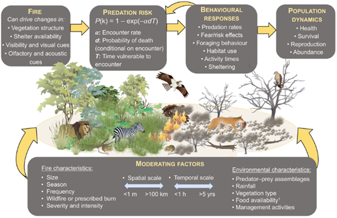{fig.alt='Conceptual model illustrating how fire influences ecosystem dynamics through linked ecological processes. At the top, four main boxes show the sequence of interactions: (1) Fire — alters vegetation structure, shelter availability, visibility, and sensory cues (olfactory/acoustic); (2) Predation Risk — expressed as P(k) = 1 - exp(-αdT), where α is encounter rate, d is probability of death given encounter, and T is time vulnerable to encounter; (3) Behavioural Responses — include changes in predation rates, fear/risk effects, foraging behavior, habitat use, activity times, and sheltering; and (4) Population Dynamics — encompassing health, survival, reproduction, and abundance. The central landscape shows a transition from lush green habitat with lions, zebras, and birds to a burned, sparse environment with predators such as cougars and raptors. Arrows connect these stages, showing feedback loops between fire, predation, and population outcomes. At the bottom, moderating factors are shown: Fire characteristics (size, season, frequency, wildfire vs. prescribed burn, severity, intensity); Spatial and temporal scales (<1 m to >100 km, <1 hr to >5 yrs); and Environmental characteristics (predator–prey assemblages, rainfall, vegetation type, food availability, management activities). The diagram illustrates how fire reshapes habitat and risk dynamics, influencing animal behavior and population-level outcomes across multiple scales.'}

- In **climate science**, diagrams often depict the carbon cycle, showing how carbon moves among the atmosphere, biosphere, and oceans. 
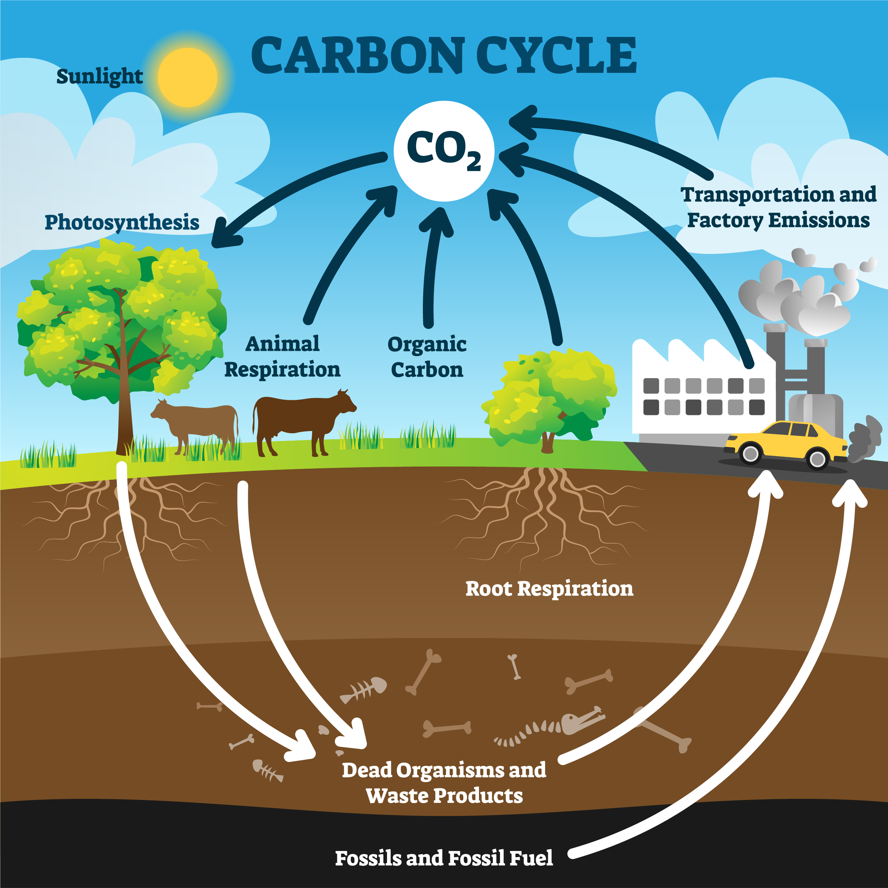{fig.alt='Illustration of the carbon cycle showing how carbon moves between the atmosphere, plants, animals, soil, and human activities. Sunlight enables photosynthesis in plants, which draw CO₂ from the atmosphere and store it as organic carbon. Animals consume plants and release CO₂ back into the air through respiration. Factories and vehicles emit CO₂ through transportation and industrial processes. Below ground, root respiration, decomposition of dead organisms and waste products, and fossil fuel formation return carbon to the atmosphere when burned. The diagram highlights the continuous exchange of carbon among biological, geological, and human systems.'}

- In **restoration ecology**, managers might sketch how reconnecting wetlands to floodplains influences nutrient cycling, fish migration, and water quality.  
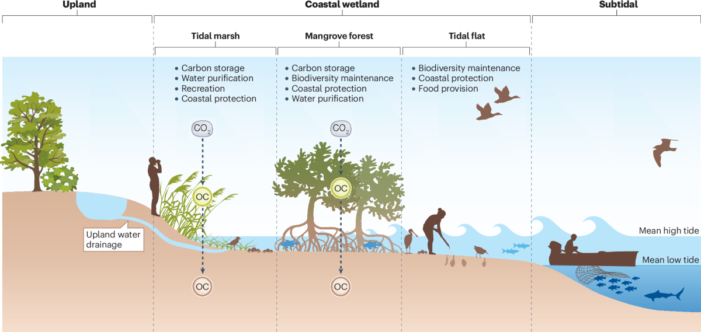{fig.alt='Illustration of carbon storage and ecosystem services across coastal habitats from upland to subtidal zones. The diagram is divided into four regions: Upland, Tidal Marsh, Mangrove Forest, and Tidal Flat, with mean high and low tide levels indicated. Upland areas contribute freshwater through drainage into the coastal wetland. In the Tidal Marsh, plants absorb CO₂ and store organic carbon (OC) in vegetation and sediments, providing carbon storage, water purification, recreation, and coastal protection. In the Mangrove Forest, mangrove trees capture CO₂, store OC in their roots and sediments, and offer carbon storage, biodiversity maintenance, coastal protection, and water purification. The Tidal Flat supports biodiversity maintenance, coastal protection, and food provision, with people collecting shellfish and fishers operating boats near the subtidal zone. Birds, fish, and aquatic organisms illustrate the ecological connectivity among these zones. The image emphasizes how different coastal ecosystems collectively provide carbon sequestration and essential ecosystem services.'}

In all of these cases, the conceptual model serves as a **foundation**: it identifies key components, reveals possible feedbacks, and ensures that stakeholders have a common understanding before quantitative equations are developed.  

---

### Empirical Models  

Empirical models are constructed **directly from observed data** and aim to capture patterns without necessarily explaining the underlying processes. They are often built using regression, curve-fitting, or other statistical approaches.  

- **Strengths.** Empirical models are quick to build when data are plentiful and can be highly accurate within the range of observed conditions. They are particularly useful for prediction tasks where explanation is less important.  
- **Limitations.** Because they are not tied to underlying mechanisms, empirical models may fail when applied outside the range of the data (poor extrapolation). They also provide little insight into *why* a system behaves the way it does.  

**Example.** A regression model might link crop yield to rainfall amount, showing that higher rainfall generally leads to higher yields up to a point. While the model captures the correlation, it does not explain the underlying processes of soil moisture dynamics, plant physiology, or nutrient cycling.  
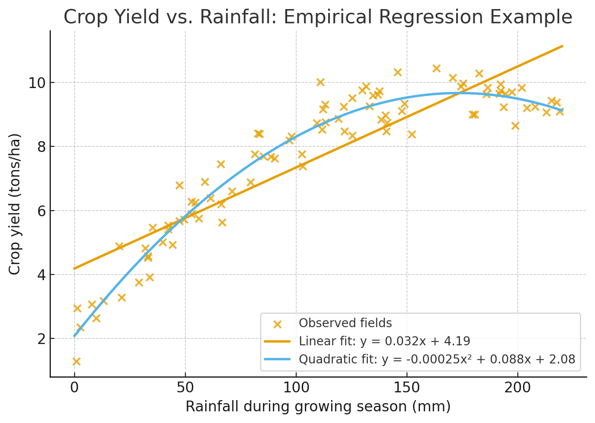{fig.alt='Scatter plot showing the relationship between rainfall amount and crop yield with fitted regression lines. Each point represents an observed field, showing that yield generally increases with rainfall up to an optimal level before declining slightly. Two regression curves are overlaid: a linear fit, showing a steady positive trend, and a quadratic fit, which captures diminishing returns at higher rainfall levels. Axes are labeled “Rainfall during growing season (mm)” and “Crop yield (tons/ha),” with a title reading “Crop Yield vs. Rainfall: Empirical Regression Example.” The plot illustrates how empirical regression models capture observed correlations without explicitly modeling underlying processes such as soil moisture, plant physiology, or nutrient cycling.'}

Empirical models are often a **first step in modeling**, helping reveal relationships that can later inspire more mechanistic or physically based models.  

---

### Mechanistic Models  

Mechanistic (or process-based) models attempt to represent the **actual physical, chemical, or biological mechanisms** driving a system. They are usually expressed in terms of equations that represent process rates or interactions.  

- **Strengths.** Mechanistic models provide deeper explanatory power by focusing on *why* a system behaves in a particular way. Because they are based on processes, they can often be applied to new situations outside the range of existing data.  
- **Limitations.** These models often require more assumptions, more data, and more expertise to build and calibrate.  

**Example.** A predator–prey model (Lotka–Volterra equations) represents how predator consumption rates depend on prey abundance, and how prey populations decline or increase depending on predator pressure. Such models capture the interaction mechanisms rather than just observed correlations. 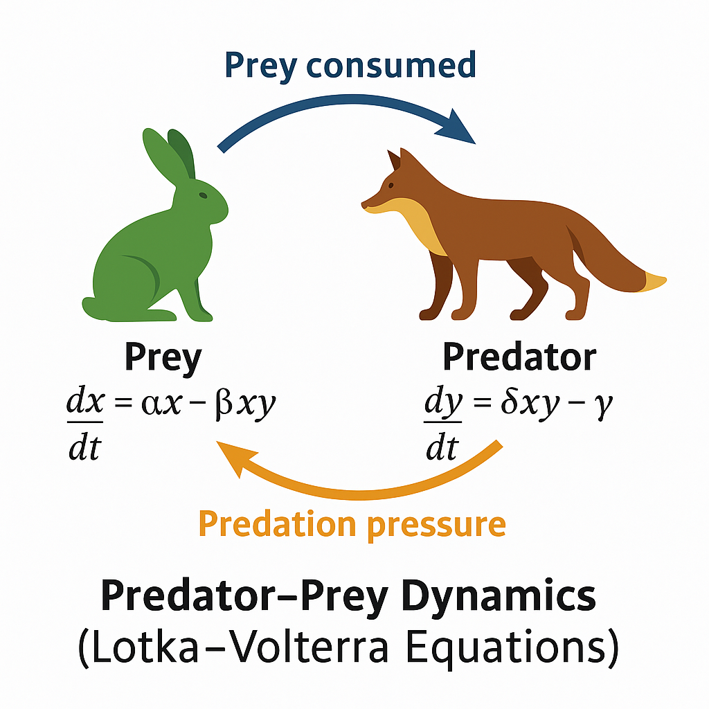{fig.alt='Conceptual diagram of predator–prey dynamics based on the Lotka–Volterra equations. On the left, a green rabbit represents the prey population with the equation dx/dt = αx − βxy. On the right, a brown fox represents the predator population with the equation dy/dt = δxy − γ. A blue arrow labeled “Prey consumed” points from the rabbit to the fox, indicating energy transfer from prey to predator. An orange arrow labeled “Predation pressure” points from the fox back to the rabbit, showing that predation reduces prey abundance. The figure title reads “Predator–Prey Dynamics (Lotka–Volterra Equations)” and illustrates the feedback loop between predator consumption and prey growth.'}

Mechanistic models are particularly valuable when the goal is **understanding causation**, not just prediction.  

---

### Physically Based Models  

Physically based models are a subset of mechanistic models that rely explicitly on **fundamental physical laws**, such as conservation of mass, energy, and momentum.  

- **Strengths.** Because they are grounded in universal principles, they are often considered more “trustworthy” and generalizable. They can be applied to different systems without retraining or refitting, as long as the physics remain the same.  
- **Limitations.** They are often data-intensive and computationally demanding, which can make them challenging to apply in data-limited or resource-constrained contexts.  

**Example.** The advection–dispersion equation in hydrology models pollutant transport in groundwater. It explicitly represents the physical processes of advection (movement with flow), dispersion (spreading), and decay.
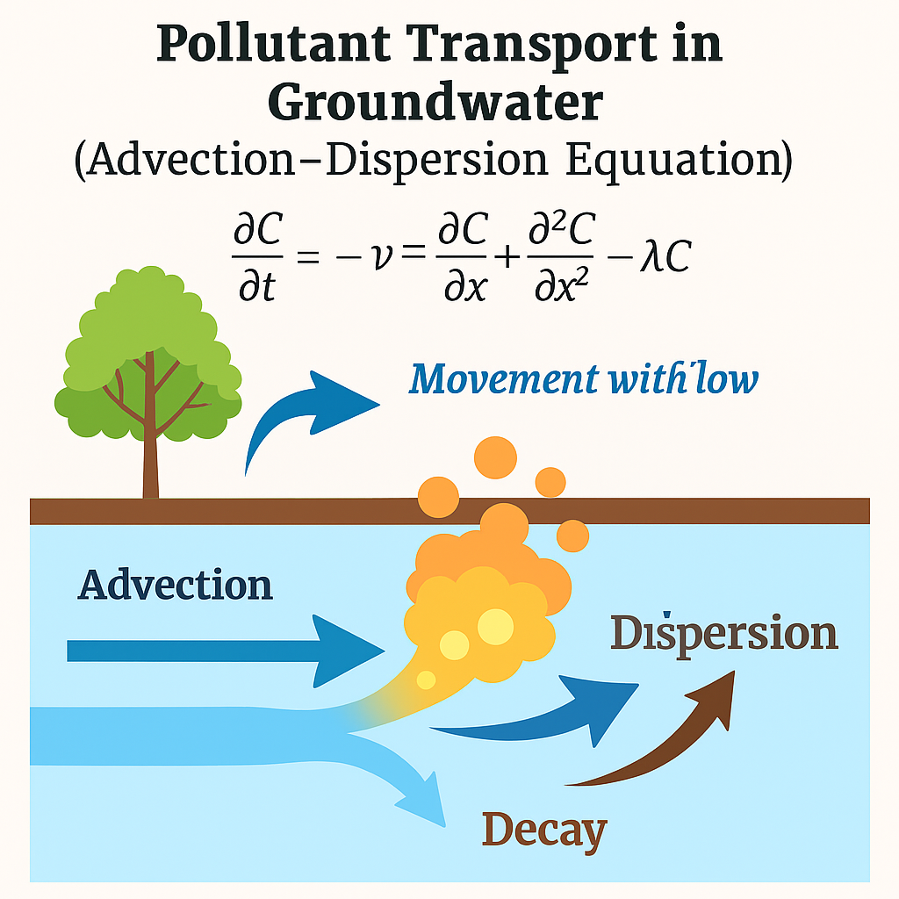{fig.alt='Conceptual diagram illustrating pollutant transport in groundwater using the advection–dispersion equation. The image shows a soil cross-section with groundwater flowing horizontally. Arrows indicate three main processes: Advection (horizontal movement of contaminants with the water flow), Dispersion (spreading of the pollutant plume downstream and outward), and Decay (gradual reduction of pollutant concentration). Above the soil surface, a tree and soil layer represent the land source of the contaminant. The mathematical form of the advection–dispersion equation is shown: ∂C/∂t = –v ∂C/∂x + ∂²C/∂x² – λC, representing how concentration C changes over time due to flow velocity v, spreading, and decay. The diagram visually communicates how pollutants move, spread, and degrade as they travel through groundwater.'}

Physically based models are essential in **hydrology, climate science, and atmospheric modeling**, where conservation principles govern large-scale dynamics.  

---

### Statistically Based Models  

Statistically based models focus on **patterns and correlations** in observed data rather than explicit mechanisms. They can include regression, generalized linear models, and modern statistical learning methods.  

- **Strengths.** They are flexible, relatively quick to build, and effective at handling noisy or messy datasets. They are often useful when mechanisms are poorly understood but data are available.  
- **Limitations.** These models can lack interpretability, may be limited to the conditions where data were collected, and can be prone to spurious correlations.  

**Example.** A multiple regression predicting air quality index (AQI) from temperature, wind speed, and traffic counts. This model may predict AQI well in urban areas with similar conditions, but may not generalize to other contexts or explain the underlying atmospheric chemistry.  

---

### Hybrid Models  

Hybrid models combine **mechanistic or physically based components** with **statistical or empirical elements**. Increasingly, they also incorporate machine learning to approximate processes that are too complex to model explicitly.  

- **Strengths.** They balance explanatory depth with predictive accuracy, making them powerful tools for modern environmental modeling. They can use physics where mechanisms are well understood and statistics where processes are uncertain.  
- **Limitations.** Hybrids can be complex to implement, requiring both strong process knowledge and advanced statistical or computational skills.  

**Example.** A climate model might use physical laws to simulate radiation balance while representing cloud formation statistically, since clouds are too complex to simulate explicitly at global scales.  

Hybrid approaches are especially useful for **large, complex systems** where no single modeling approach is sufficient.  

---

### Probability-Based Models  

Probability-based models incorporate **randomness and uncertainty explicitly** into the modeling process.  

- **Types.**  
  - **Stochastic models**: allow variables to fluctuate randomly (e.g., rainfall arrivals modeled as a Poisson process).  
  - **Monte Carlo simulations**: use repeated random sampling to explore uncertainty in parameters or inputs.  
  - **Markov models**: describe transitions between discrete states with probabilities (e.g., land cover change from forest to agriculture).  

- **Strengths.** These models are well-suited for risk analysis and decision-making under uncertainty, since they provide probabilities rather than deterministic outcomes.  
- **Limitations.** They require careful specification of probability distributions, and results can be sensitive to those assumptions.  

**Example.** Wildfire spread models often use probabilistic elements to capture random ignition events, wind shifts, and fuel variability. While no one can predict the exact path of a fire, probability-based models estimate likely outcomes and risks.  
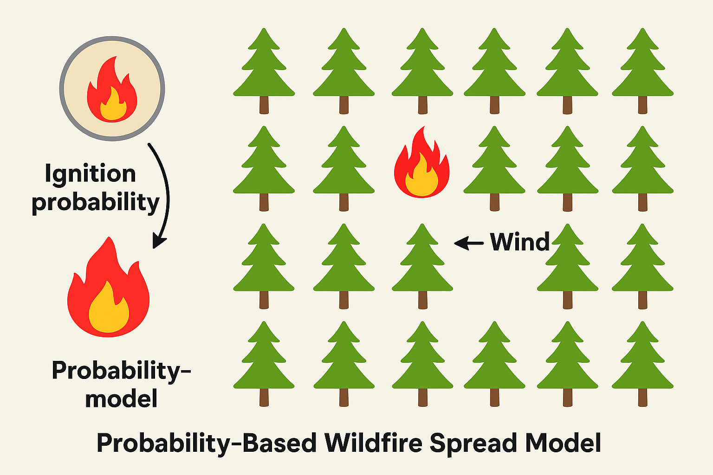{fig.alt='Conceptual diagram showing a probability-based wildfire spread model using a grid of trees. On the left, a coin labeled “Ignition probability” represents the random chance of fire starting, with fire and no-fire outcomes. The main grid shows rows of green trees, one of which is burning, indicating a fire event influenced by probabilistic ignition. An arrow labeled “Wind” points in the direction of fire spread, representing environmental factors affecting likelihood. The figure title reads “Probability-Based Wildfire Spread Model” and conveys that wildfire models estimate likelihoods of fire spread rather than deterministic outcomes.'}

---

### Discrete vs Continuous Models  

The choice between **discrete** and **continuous** models depends on how processes unfold and how data are collected.  

- **Discrete models** describe systems in stepwise updates, often expressed as difference equations.  
  - **Example.** Annual updates of a fish population with seasonal reproduction, where population counts are only recorded once a year.  

- **Continuous models** describe change as a smooth process in time or space, often expressed as differential equations.  
  - **Example.** Logistic growth of a population or chemical reaction kinetics, where changes occur continuously over time.  

- **Comparison.**  
  - Discrete models are natural when processes occur in pulses (e.g., seasonal breeding) or when data are only periodic.  
  - Continuous models are appropriate when change is ongoing and smooth (e.g., temperature variation through the day).  

In practice, modelers often switch between discrete and continuous formulations depending on data availability, computational needs, and the nature of the process being studied.  

---

### Summary  

These categories—conceptual, empirical, mechanistic, physically based, statistically based, hybrid, probability-based, discrete, and continuous—are not mutually exclusive. Many real-world models blend features from several categories. For example, a water quality model might use physically based equations for pollutant transport (continuous), include a statistical relationship for uncertain decay rates, and apply Monte Carlo simulations to capture uncertainty. The art of modeling lies in choosing the right combination of approaches that best fits the scientific or management question at hand.  

---

## Growth Models  

Growth models describe how quantities change over time. They are among the most widely used mathematical models in environmental science because they capture how populations expand, resources are consumed, or pollutants accumulate and decline. Each model makes assumptions about what drives growth, what limits it, and whether change is smooth or sudden. Below we introduce several canonical growth forms. 
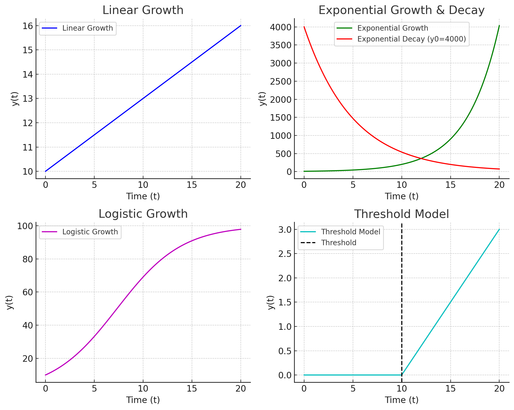{fig.alt='Four-panel figure comparing common mathematical models of change. Top left: Linear Growth shows a straight line increasing steadily over time. Top right: Exponential Growth (green) rises steeply, while Exponential Decay (red) starts at an initial value of 4000 and decreases smoothly toward zero. Bottom left: Logistic Growth shows an S-shaped curve leveling off near a carrying capacity of 100. Bottom right: Threshold Model shows a flat line until a threshold at t = 10 (dashed vertical line), after which it rises linearly. Each subplot is labeled with axes for time (t) and value y(t).'}

---

### Linear Growth  

The simplest growth model is **linear growth**, where change occurs at a constant rate:  

\[
y(t) = y_0 + rt
\]

- Here, \(y_0\) is the initial value and \(r\) is the constant rate of change.  
- The relationship is straightforward: every unit of time adds the same amount.  

**Environmental example.** If a forest loses 1,000 hectares per year due to logging, the total deforested area increases linearly with time.  

**Strengths and limitations.** Linear growth is intuitive and easy to apply, but it rarely captures long-term dynamics because most systems eventually accelerate, decelerate, or fluctuate rather than changing at a constant rate.  

---

### Exponential Growth  

Exponential growth occurs when the rate of change is proportional to the current size:  

\[
y(t) = y_0 e^{rt}
\]

- \(r\) is the intrinsic growth rate, and \(y_0\) is the initial value.  
- Growth accelerates as the quantity increases, leading to the famous “hockey-stick” curve.  

**Environmental example.** An invasive species introduced to a new habitat may grow exponentially at first, since resources are abundant and predators are absent.  

**Key property.** Exponential growth has a doubling time given by:  

\[
t_d = \frac{\ln 2}{r}
\]  

**Strengths and limitations.** Exponential models are powerful for short-term predictions but unrealistic over long periods, since no population or pollutant can grow without bound.  

---

### Logistic Growth  

To incorporate resource limits, the **logistic growth model** modifies exponential growth by adding a ceiling:  

\[
y(t) = \frac{K}{1 + A e^{-rt}}, \quad A = \frac{K - y_0}{y_0}
\]

- \(K\) is the **carrying capacity**, the maximum sustainable level.  
- \(r\) is the intrinsic growth rate.  
- \(y_0\) sets the initial condition.  

**Environmental example.** A fish population in a lake may grow quickly when small but will slow as competition for food intensifies, eventually stabilizing around a carrying capacity.  

**Key features.**  

- Growth is fast at first, then slows as \(y(t)\) approaches \(K\).  
- Produces an S-shaped (sigmoid) curve.  
- Sensitive to both the growth rate \(r\) and the initial population \(y_0\).  

**Strengths and limitations.** Logistic models capture the idea of limits and feedbacks, making them more realistic than exponential growth. However, real systems may not have fixed carrying capacities—they can change seasonally or due to human interventions.  

---

### Decay Models  

Not all processes involve growth. Many environmental problems involve **decay**, where a quantity decreases over time, often following an exponential law:  

\[
y(t) = y_0 e^{-\lambda t}
\]

- \(\lambda\) is the decay constant.  
- \(y_0\) is the initial value at \(t=0\).  

**Environmental examples.**  

- Pollutant concentrations decline after a cleanup effort.  
- Radioactive isotopes lose mass at a fixed half-life.  

**Key property.** The half-life is given by:  

\[
t_{1/2} = \frac{\ln 2}{\lambda}
\]  

**Strengths and limitations.** Decay models are excellent first approximations but may oversimplify when multiple processes (e.g., mixing, resuspension, or nonlinear reactions) occur simultaneously.  

---

### Piecewise / Threshold Models  

Some systems behave differently depending on conditions. **Piecewise** or **threshold models** capture these shifts by switching between rules depending on whether a threshold is crossed.  

- Example function:  
  \[
  f(x) = 
  \begin{cases} 
    0 & \text{if } T \leq 0^\circ C \\
    r(T) & \text{if } T > 0^\circ C
  \end{cases}
  \]  

**Environmental example.** Snowpack remains stable when air temperatures are below freezing but begins to melt rapidly once temperatures exceed 0 °C. Similarly, algal blooms may only occur when nutrient concentrations exceed a critical threshold.  

**Strengths and limitations.** Threshold models are powerful for representing abrupt changes, but they can be difficult to calibrate because identifying the exact threshold requires detailed data.  

---

### Putting It All Together  

Each of these growth models represents a different **story of change**:  

- Linear growth assumes constant addition.  
- Exponential growth assumes self-reinforcing acceleration.  
- Logistic growth assumes feedback and limits.  
- Decay assumes continual decline.  
- Threshold models assume sudden shifts once a condition is met.  

In environmental modeling, these forms are often combined or extended. For instance, population models might include logistic growth with seasonal thresholds, while pollutant decay models might combine exponential decline with inflow terms. Choosing the right growth model is less about mathematical elegance and more about capturing the **essential dynamics** of the system under study.  

---

## Parameters in Growth Models  

Growth models are defined not just by their structure (linear, exponential, logistic, etc.) but also by their **parameters**. Parameters are the constants that govern how the system behaves. In growth models, the most common parameters include the **intrinsic growth rate** (\(r\)), the **carrying capacity** (\(K\)), and the **decay constant** (\(\lambda\)). By adjusting these parameters, the same mathematical structure can represent very different ecological or environmental realities.  

---

### The Role of Parameters  

- **Growth rate (\(r\))** determines how quickly a population expands or a pollutant concentration changes. A higher \(r\) means faster growth or decline.  
- **Carrying capacity (\(K\))** represents the maximum sustainable size of a population given resource constraints. It can change with environmental conditions such as food availability, habitat size, or climate.  
- **Decay constant (\(\lambda\))** dictates how quickly a substance or population decreases, often through chemical breakdown, radioactive decay, or mortality.  

Without parameters, models would be abstract formulas with no connection to the real world. Parameter values bring models to life by grounding them in observed systems.  

---

### Sensitivity Analysis  

A key step in working with models is asking: **how sensitive is the outcome to the values of the parameters?**  

- If a small change in \(r\) leads to a large change in population size over time, then accurate estimation of \(r\) is crucial.  
- If the outcome hardly changes when \(K\) is varied, then the model may be robust to uncertainty in that parameter.  

Sensitivity analysis helps us:  
1. Identify which parameters matter most.  
2. Focus data collection on the most influential parameters.  
3. Understand the uncertainty in model predictions.  

**Example.** A fish population with a growth rate \(r=0.2\) per year reaches its carrying capacity in about 20 years. If \(r\) is actually 0.25, the same population may reach capacity in only 15 years. Such differences have direct management implications for harvest rules.  

---

### Visualization with Parameter Sweeps  

One effective way to explore parameter influence is through **parameter sweeps**—systematically varying one parameter while holding others constant and plotting the results.  

- Plotting logistic growth curves for several values of \(r\) shows how faster growth accelerates the time to reach carrying capacity.  
- Plotting curves for different \(K\) values illustrates how the ceiling of growth changes.  

Parameter sweeps reveal families of curves and make the sensitivity of the system visually clear.  

*Environmental example.* Suppose two wetlands support frog populations with the same growth rate (\(r\)) but different carrying capacities (\(K=500\) vs. \(K=1000\)). A visualization would show both populations growing rapidly at first, but one leveling off sooner due to lower resource limits.  

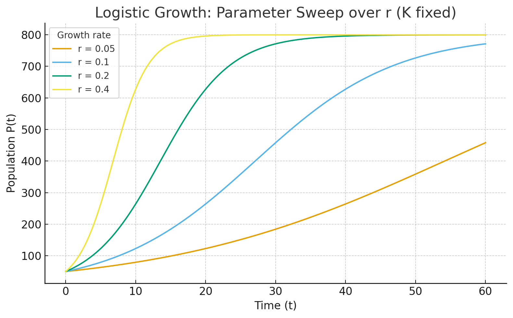{fig.alt='Logistic growth parameter sweep over r with K fixed at 800. Family of S-shaped curves starting at 50; higher r values rise and level off faster at 800.'}

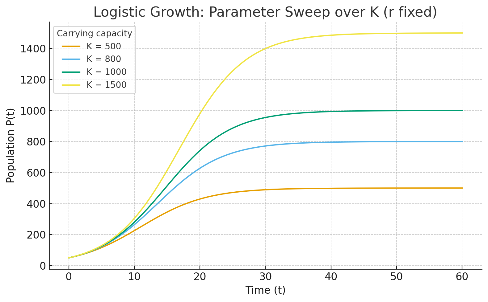{fig.alt='Logistic growth parameter sweep over K with r fixed at 0.2. Family of S-shaped curves with asymptotes at K = 500, 800, 1000, and 1500, showing higher ceilings for larger K.'}

---

### Comparing Competing Species  

Parameters also allow us to compare species or systems in meaningful ways.  

- **Example: Competing plants.** Two plant species colonize a disturbed site. Species A has a higher growth rate (\(r\)) but a lower carrying capacity (\(K\)) due to limited resource efficiency. Species B has a slower growth rate but a higher carrying capacity. Which species dominates depends on the timescale of interest: in the short term, Species A may dominate, but in the long term, Species B may outlast it.  

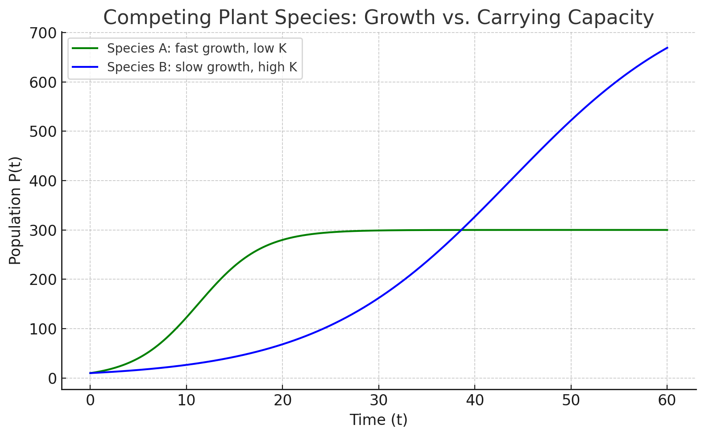{fig.alt='Plot comparing two competing plant species using logistic growth. Species A (green) has a higher growth rate and quickly rises but levels off near a lower carrying capacity of 300. Species B (blue) grows more slowly but eventually surpasses Species A, leveling off near a higher carrying capacity of 800. The x-axis shows time, and the y-axis shows population P(t), illustrating how Species A dominates early but Species B outlasts it in the long term.'}

- **Example: Invasive vs native fish.** An invasive fish species may have a larger \(r\), allowing it to spread quickly, while a native species may be closer to carrying capacity. Understanding both parameters can guide whether intervention is urgent.  

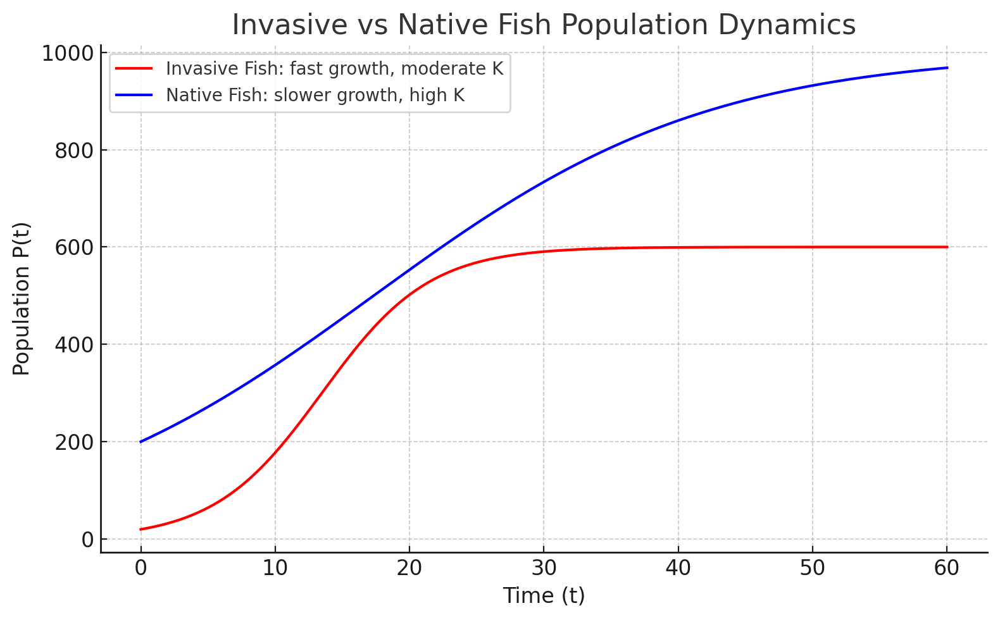{fig.alt='Plot showing invasive vs native fish populations under logistic growth. The invasive fish (red) starts smaller but has a higher growth rate, rising quickly and leveling off near a carrying capacity of 600. The native fish (blue) starts with a larger initial population, grows more slowly, and levels off near a higher carrying capacity of 1000. The x-axis shows time, and the y-axis shows population P(t). The figure illustrates how the invasive species spreads rapidly in the short term, while the native species maintains dominance in the long term.'}

---

### Summary  

Parameters are the levers of growth models. By adjusting \(r\), \(K\), or \(\lambda\), the same mathematical structure can represent radically different ecological stories. Sensitivity analysis and parameter sweeps help identify which parameters drive system behavior, while comparative studies show how parameter differences can explain species competition and coexistence. In practice, estimating parameters from data is one of the most challenging but most important aspects of environmental modeling.  

---

## Fitting Models to Data  

So far we have introduced growth models as equations with parameters like \(r\), \(K\), or \(\lambda\). But how do we actually determine the values of these parameters for a real-world system? This is where **fitting models to data** comes in. By comparing model predictions with observational data, we can estimate parameter values, assess how well the model represents reality, and quantify uncertainty.  

---

### From Observations to Parameters  

Environmental systems are usually monitored through field measurements, laboratory experiments, or remote sensing. These observations give us time series or spatial data that can be compared with model outputs.  

- **Example.** Suppose we have a dataset of fish population counts from annual surveys of a lake. We can use these observations to estimate the growth rate \(r\) and carrying capacity \(K\) in a logistic model.  

Our first decision is which model suits this situation.

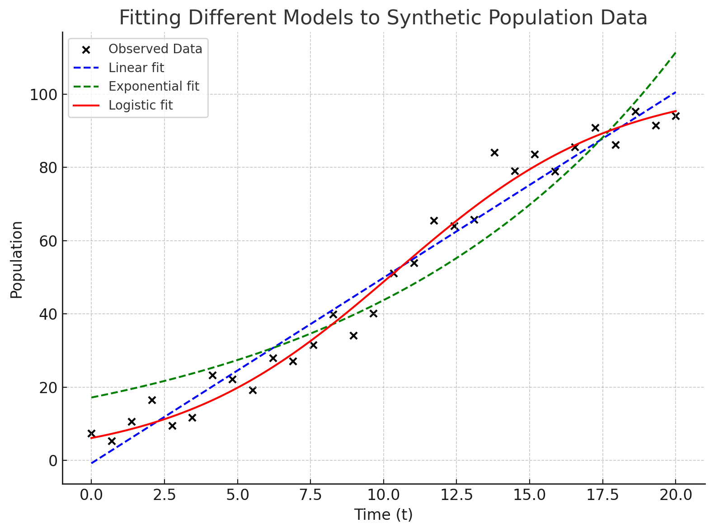{fig.alt='Plot showing synthetic population data points (black dots) with three fitted models. The linear model (blue dashed) increases steadily but does not capture leveling off. The exponential model (green dashed) rises too steeply and overshoots at later times. The logistic model (red solid) follows the data closely, capturing the S-shaped curve and plateau near carrying capacity. This illustrates how different model choices can fit the same data with varying accuracy.'}
Once we decide on a model form, we then need to determine the best **parameter set**.
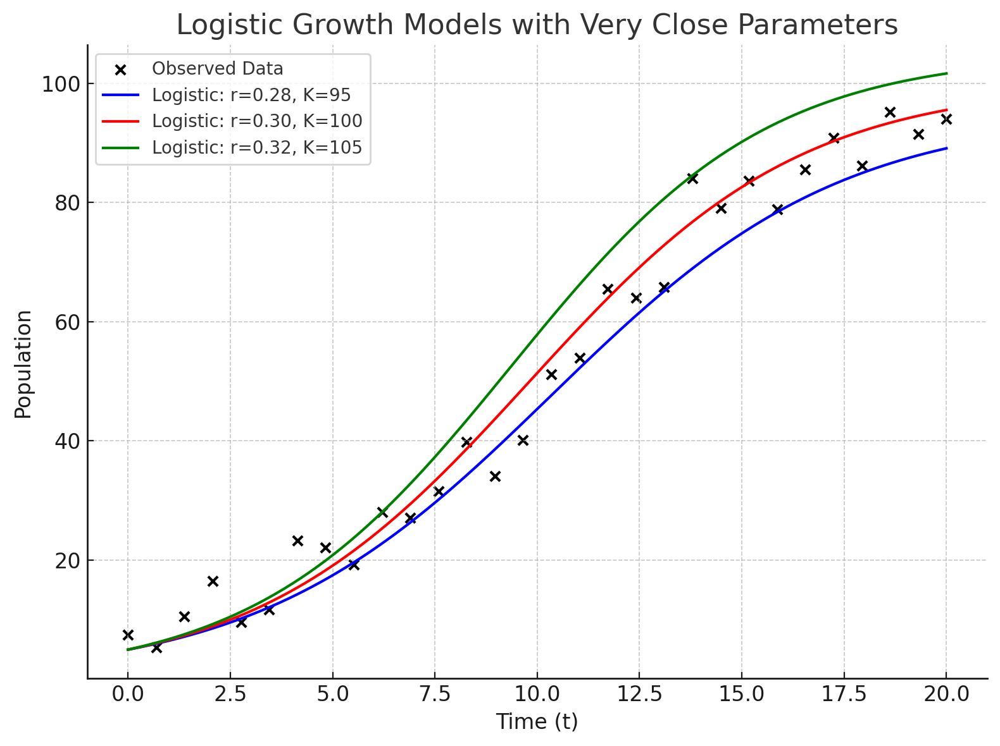{fig.alt='Plot showing synthetic population data points (black dots) with three logistic model fits using very close parameter values. The blue curve (r=0.28, K=95) rises slightly more slowly and levels off just below 100. The red curve (r=0.30, K=100) fits near the observed data and stabilizes at 100. The green curve (r=0.32, K=105) grows slightly faster and levels off just above 100. The three curves overlap strongly, illustrating how subtle parameter changes produce only small differences in logistic growth behavior.'}

The goal is to select the right model and adjust model parameters so that the model trajectory matches the observed data as closely as possible.  

---

### Methods of Parameter Estimation  

Several approaches exist for estimating parameters from data. The choice depends on the model type, the data available, and the assumptions we are willing to make.  

- **Regression methods.**  
  - Linear regression is used when the model can be written in a straight-line form.  
  - Nonlinear regression extends this to curves like logistic or exponential models.  

- **Least squares estimation.**  
  - One of the most common approaches is to minimize the **sum of squared errors** (SSE) between observed values and model predictions:  
    \[
    SSE = \sum_{i=1}^n \big(y_{\text{obs},i} - y_{\text{model},i}\big)^2
    \]  
  - The parameter values that minimize the SSE are considered the best fit.  

- **Maximum likelihood estimation (MLE).**  
  - A more general method that finds parameters most likely to produce the observed data under a given probability distribution.  
  - Often used when data are noisy or when errors do not follow a simple normal distribution.  

---

### Uncertainty and Error  

No parameter estimate is exact. Uncertainty arises from measurement error, sampling variability, and model assumptions. Good modeling practice requires quantifying and communicating this uncertainty.  

- **Confidence intervals** around parameter estimates show the plausible range of values.  
- **Residual analysis** (examining the differences between observed and predicted values) helps detect patterns that indicate model misfit.  
- **Cross-validation** (fitting the model to part of the data and testing it on the rest) helps assess predictive power.  

In some cases, uncertainty in parameters can be propagated through the model using techniques such as Monte Carlo simulation, producing a range of possible outcomes rather than a single prediction.  

---

### Summary  

Fitting models to data is the bridge between theory and reality. Observations allow us to estimate parameters, while regression and least squares methods provide systematic ways to find the best fit. A logistic fit to population data is a classic example, but the same principles apply to pollutant decay, climate trends, or forest growth. Always remember that parameter estimates come with uncertainty, and acknowledging error is just as important as reporting the “best” values.  

---

