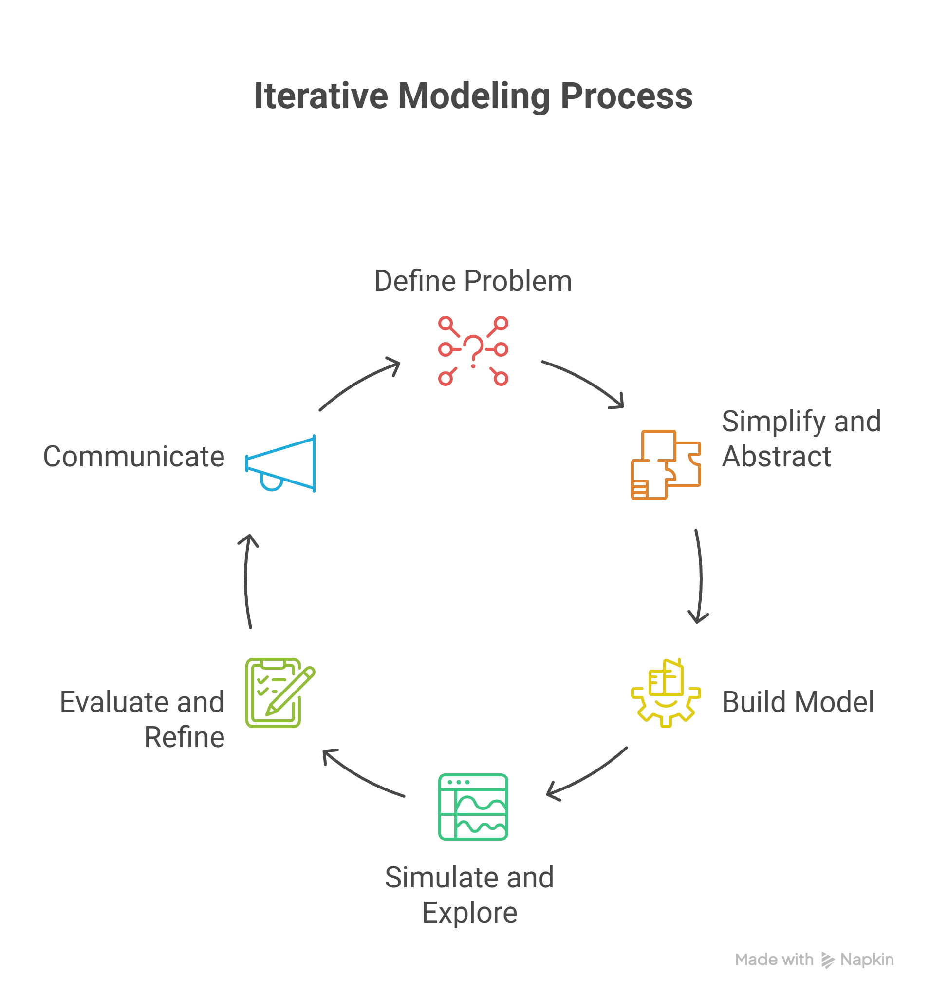
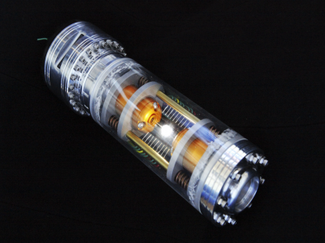

# Workbook Week 1: What is Modeling?
::: promptbox

**Class Discussion**

Lets build a working definition of the central components of this course.
In your groups see if you can define

- Coding
      
- Models/Modeling 
      
- Simulation
      
- Systems
      
- Logic
      
- Syntax
      
:::

::: promptbox
A key skill in being a modeler is the ability of abstraction

**Sketching Exercise**

A sketch is a visual model. 
Task:

- Draw a picture of a chair (1min)
- Share your picture with those around you
- What **assumptions** did you all make in your **model**
- Which sketch was right?

        

:::

::: promptbox
**Systems Thinking - what do we mean by this?**

      
Lets do my phd in 5 mins - plants in desert systems - lets think about this as a system.

{fig.alt='A flow digram that circles back on itself. Starts with define the problem which feeds to simplify and abstract, then build a model, simulate and explore, evaluate and refine and finally communicate' style="float:right"}

                                    

:::

::: promptbox
**Pseudo code**

The art of writing good instructions

I'm a robot, and you want me to toast a bagel and put Vegemite on it. 
Write me the pseudo code to make this happen.

             

:::

**This is what happens when you give bad instructions:**

<iframe width="320" height="576" src="https://www.youtube.com/embed/ZrkAt_7qQb8" title="How to toast a bagel" frameborder="0" allow="accelerometer; autoplay; clipboard-write; encrypted-media; gyroscope; picture-in-picture; web-share" referrerpolicy="strict-origin-when-cross-origin" allowfullscreen></iframe>

**This is what's possible with complete instructions:**

  <iframe width="560" height="315" 
    src="https://www.youtube.com/embed/0eIryyzlRwA?si=K8Ajupl-4uugLgR2" 
    title="YouTube video player" 
    frameborder="0" 
    allow="accelerometer; autoplay; clipboard-write; encrypted-media; gyroscope; picture-in-picture; web-share" 
    referrerpolicy="strict-origin-when-cross-origin" 
    allowfullscreen>
  </iframe>

::: promptbox
**Group activity - Dice**
We want to know what the most likely total you would get from rolling two 6 sided die.
Write some pseudo code to collect data to help you work this out.

             

:::

::: promptbox
**Guessing Game**

Write pseudo code that would count how many guesses you would take to find a number between 1 and 10.

             

:::

::: promptbox
**Needle in a Haystack**

{fig.alt='Decorative' style="float:right"}
  
In the Dan Brown novel 'Angels and Demons' the Vatican is about to be blown up by a antimatter device. In the movie, the *bad guys* has a webcam on the device. Someone has the idea of systematically cutting power to the different sectors of the power grid to narrow down the location. They dismiss is because they work out there isn't enough time to cycle through all the sectors.

But you took my class and actually make this idea work.

Lets assume:

- We have 1,048,576 possible sectors.
- It takes 1hr for a sector to respond to a change

What's the **longest** time it would take to find the sector?
What is the **shortest** time it would take to be **sure** you found the sector?

Write some pseudo code

                  
:::

\appendix
