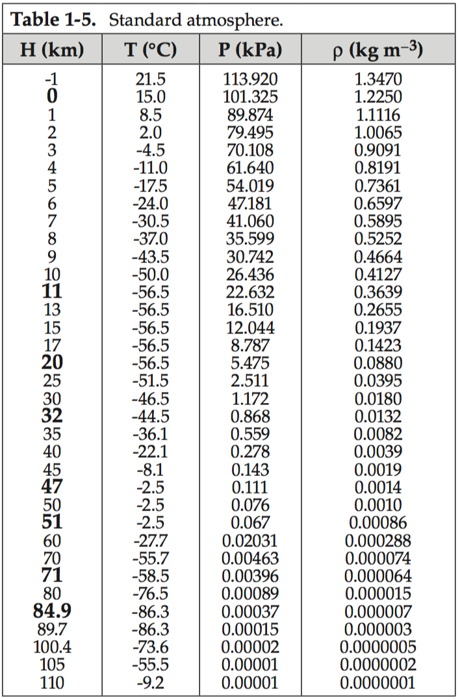
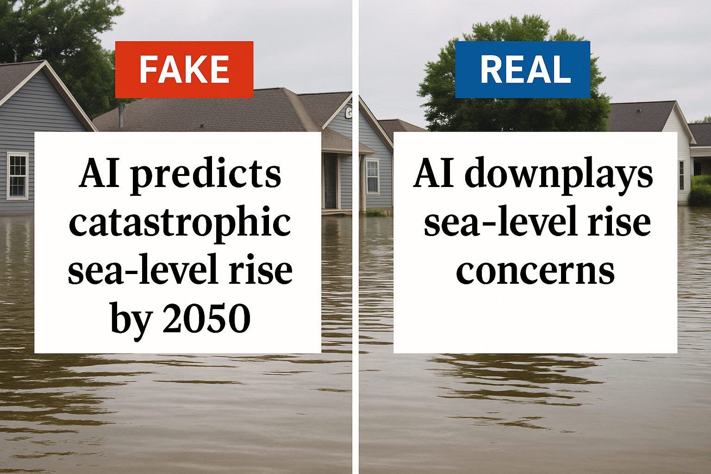
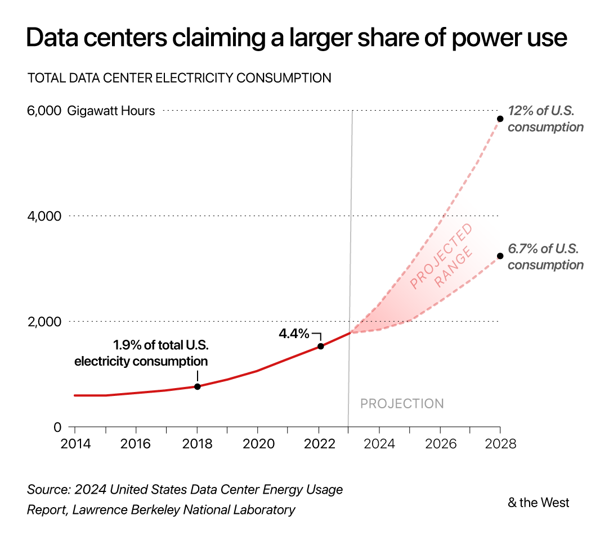
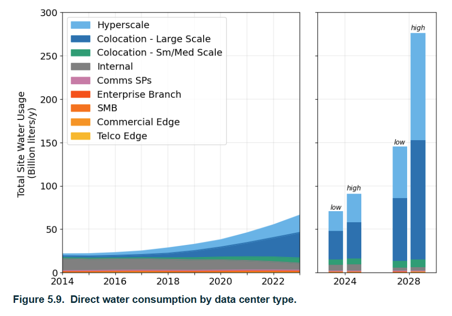
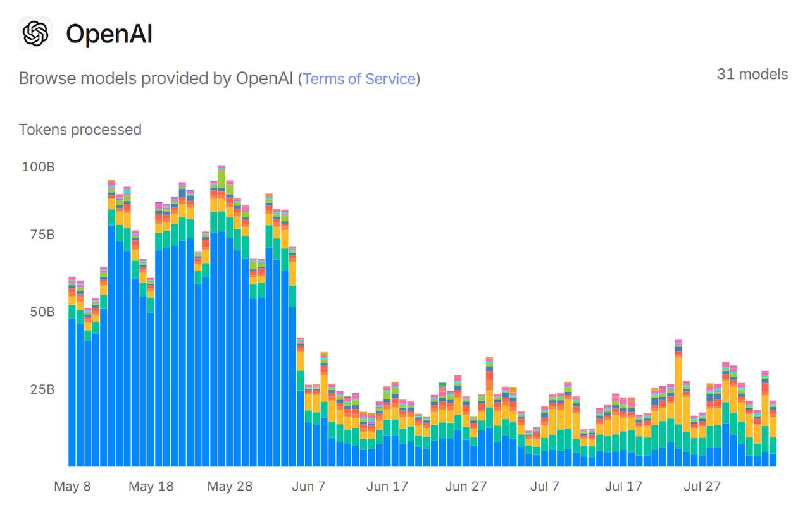

# Workbook Week 2: LLMs

## How to Build Complixity into a Problem

We briefly discussed the need to layer complexity when trying to model. Lets work through an example of that.

::: promptbox
**Banksy's Balloon Model**

{fig.alt='Decorative' style="float:right"}
Have you ever wondered what happens to a helium filled balloon that is released?
What we will do is build a mathematical model of the balloon to help answer this question.

**What controls the height at which a the balloon will climb?**

$$B(z) = f($$
         

:::

::: promptbox

**Abstraction** 

What is the simplest form of the problem we could solve?

What assumptions could we make to help us get started?

         
:::

::: promptbox

**Neutral Buoyancy**

Given the table below and the density information about helium.
What height would the balloon get to?

At sea-level conditions (about \(T = 288\,\text{K}\), \(P = 101{,}325\,\text{Pa}\)):

- Helium density:  
  \[
  \rho_{\text{He}} \approx 0.1785\ \text{kg/m}^3
  \]

{fig.alt='standard atmosphere table, relates Height, Temperature, Pressure and density'}

:::

::: promptbox

**Evaluate and then add complexity**

Does this feel right? 

What assumptions did we make that might have been *too* simplistic?

What math model could we apply to add complexity?

         

:::

::: promptbox
**Ideal Gas Law**

The **ideal gas law** relates the pressure, volume, temperature, and number of moles of a gas:

\[
PV = nRT
\]

---

**Definitions**

- \(P\): Pressure of the gas (Pa or atm)  
- \(V\): Volume of the gas (m³ or L)  
- \(n\): Number of moles of gas (mol)  
- \(R\): Ideal gas constant  
  - \(8.314\ \text{J·mol}^{-1}\text{·K}^{-1}\) (SI units)  
  - \(0.08206\ \text{L·atm·mol}^{-1}\text{·K}^{-1}\) (common chemistry units)  
- \(T\): Absolute temperature (Kelvin, K)

---

**Notes**
- The equation assumes an **ideal gas** (no inter-molecular forces, particles take up negligible space).  
- Works well for helium and other light gases at normal temperatures and pressures.  
- Can be rearranged into useful forms, e.g. density:

:::

::: promptbox
**Flexible Balloon**

Let's let the volume of the balloon change - removing the rigid balloon requirement.

\[
PV = nRT
\]

Rearranging for n:

\[
n = \frac{PV}{RT}
\]

We know **n** can't change as the balloon isn't leaking.
So we can think of the balloon in two places 

\[
n_{msl} = n_{top}
\]

so plug the rest in

\[
\frac{P_1V_1}{T_1}=\frac{P_2V_2}{T_2}
\]

Ask ourselves what changes based on out assumptions

**What is going to happen to the volume of the balloon as it climbs?**

         

**What happens to the density of helium if the volume increases?**
\[
\rho = \frac{M}{V}
\]

         

**Evaluate - Does this make sense?**
         

:::

<iframe width="560" height="315" src="https://www.youtube.com/embed/jXP-va2t4D8?si=3UgJ4TaXNXNT5DFq" title="YouTube video player" frameborder="0" allow="accelerometer; autoplay; clipboard-write; encrypted-media; gyroscope; picture-in-picture; web-share" referrerpolicy="strict-origin-when-cross-origin" allowfullscreen></iframe>

The next thing is to model where the balloon will land. This tool uses the near term forecast as well as the balloon's parameters to determine the most likely trajectory.

[SondeHub Flight Predictor](https://predict.sondehub.org/ "SondeHub balloon flight predictor")

## LLMs and Modeling Support

### Learning Objectives

By the end of this week, students should be able to:

- Explain what large language models (LLMs) are and how they can support simulation and coding.  
- Apply prompt engineering techniques to improve model development.  
- Use LLMs to re-frame and clarify environmental modeling challenges.  
- Critically evaluate when and how it is appropriate to use AI tools in science.  
- Incorporate LLMs into workflows for reproducibility, documentation, and troubleshooting in R.  

### Coding warmup

::: promptbox

**Pseudo-code and r script activity**

- Create a script that fits a line of best fit to the following string of 10 numbers

  - 6,1,7,2,3,3,9,3,3,0

- Create the flexibility in the code to fit a nth order polynomial of your choosing. 
- Before you run build an expectation
  - What do expect the graph to look like with n=1
  - n=5
  - n=9
  - n=12
- What evaluation tools/outputs could you create so that you can 'test' the output?
- Compare your expectations with your output
- Compare your outputs with the people around you

             
:::

### What is a Large Language Model

::: promptbox

**1 min Discussion**
What is a LLM and how does it work?

             
:::

::: promptbox

**Class Discussion**
What are the dangers of highly parameterized model?

Pros and cons of parameter counts?

             

:::

### Pros and Cons of High-Parameter Models

High-parameter (or “high-complexity”) models — like very high-degree polynomials, deep neural networks with many layers, or regression models with lots of predictors — have clear advantages and drawbacks.

---

#### ✅ Pros

1. **Flexibility & Expressiveness**  
   - Can capture very complex relationships, including nonlinear patterns that simple models would miss.  
   - For example: a 9th-degree polynomial can fit 10 points exactly.

2. **Low Training Error**  
   - With enough parameters, the model can drive error on the training set down to nearly zero.  
   - Useful if your goal is interpolation of the given data rather than generalization.

3. **Captures Subtle Structure**  
   - Sometimes, especially with rich datasets, complexity helps reveal real underlying trends that simpler models would smooth over.

---

#### ❌ Cons

1. **Overfitting**  
   - The model fits noise as if it were signal.  
   - Predictions on new data are often unstable and inaccurate.

2. **Interpretability**  
   - High-degree polynomials or models with many coefficients are hard to interpret or explain.  
   - Coefficients may be large, unstable, or counter-intuitive.

3. **Numerical Instability**  
   - High-order polynomials can produce `NA`s or huge coefficients due to ill-conditioning.  
   - Small changes in input lead to large swings in output.

4. **Computational Cost**  
   - More parameters = more computation, longer training, and sometimes risk of convergence issues.

5. **Generalization Risk**  
   - High training accuracy doesn’t guarantee real-world usefulness.  
   - Models may fail badly outside the range of training data.

---

### Parameters in Large Language Models (LLMs)

Large Language Models (LLMs) are defined in part by the **number of parameters** they contain — the trainable weights in their neural networks. These parameters are like knobs the model adjusts during training to learn patterns in data.

---

#### ⚙️ Parameters in Modern LLMs

- **GPT-2 (2019)** → ~1.5 **billion** parameters  
- **GPT-3 (2020)** → 175 **billion** parameters  
- **PaLM (Google, 2022)** → 540 **billion** parameters  
- **GPT-4 (2023)** → parameter count not officially disclosed, but estimates suggest **hundreds of billions to over a trillion**  
- **GPT-4 Turbo (2023, OpenAI API)** → optimized variant, size undisclosed, but still in the “hundreds of billions” range  
- **Anthropic’s Claude 3 (2024)** → not public, but assumed similar scale (hundreds of billions)  
- **Gemini Ultra (Google DeepMind, 2024)** → also undisclosed, estimated **trillion-scale**

---

#### 📊 What “Parameters” Mean

- **Each parameter** is just a number (a weight) that influences how input tokens get transformed through the layers of the neural net.  
- More parameters = more capacity to model complex relationships, but also:  
  - Requires more **data** to train  
  - Much more **compute** (training GPT-3 took thousands of GPUs for weeks)  
  - Can increase risk of **overfitting** if not carefully regularized  

---

#### 🚀 Trend in LLM Growth

- **2018–2020** → billions of parameters  
- **2021–2023** → hundreds of billions  
- **2024 onward** → trillion+ parameter models (but with a shift toward *efficiency* — smaller models trained better)  

Contextualizing these large numbers
1 million seconds --> 11.6 days
1 billion seconds --> 31.7 years (~1.5 of your lifetimes)
1 trillion seconds --> 31,700 years (~1,500 your lifetimes)

---

#### 📑 Table: LLMs and Parameter Counts

| Model                  | Year | Parameters (approx.) | Notes |
|-------------------------|------|----------------------|-------|
| GPT-2                  | 2019 | 1.5B                 | First widely known OpenAI LLM |
| GPT-3                  | 2020 | 175B                 | Major leap in scale |
| PaLM (Google)           | 2022 | 540B                 | Pathways Language Model |
| GPT-4                  | 2023 | 100B–1T (est.)       | Exact number undisclosed |
| GPT-4 Turbo            | 2023 | 100B+ (est.)         | Optimized API variant |
| Claude 3 (Anthropic)   | 2024 | 100B+ (est.)         | Scale similar to GPT-4 |
| Gemini Ultra (Google)  | 2024 | 1T+ (est.)           | Trillion-scale model |

---

✅ **Summary**: Modern LLMs like GPT-4, Claude 3, or Gemini are likely running in the **hundreds of billions to trillions of parameters** range.

### Capabilities and Limits of LLMs

::: promptbox
**Discussion**: What are the Capabilities and Limits of LLMs
             
:::

::: promptbox
**Reflection Prompt**  
**Capabilities and Limits of LLMs**

**✅ Capabilities of LLMs**

- **Generate readable text in many styles**  
  - Scientific summaries  
  - Conversational explanations  
  - Adapt tone for peers, policymakers, or the public  

- **Produce and troubleshoot code**  
  - Works across multiple languages (R, Python, MATLAB)  
  - Draft starter scripts, find syntax errors, explore alternatives  

- **Summarization tools**  
  - Condense long articles, datasets, or equations  
  - Highlight key insights and trends  

- **Translate technical content into plain language**  
  - Make specialized knowledge understandable to non-experts  
  - Support communication of environmental science to diverse audiences  

**⚠️ Limits of LLMs**

- **Hallucination**  
  - Can produce text that sounds plausible but is factually wrong  

- **Bias in training data**  
  - May reproduce stereotypes or skew perspectives  

- **Lack of true reasoning/understanding**  
  - Predicts patterns statistically, not by scientific comprehension  
  - Explanations may oversimplify or omit key assumptions  

- **Reproducibility challenges**  
  - Same prompt can yield different outputs  
  - Hard to fully standardize in scientific workflows  
  

- Which of the capabilities described here could have supported your work?  
- Which limitations would you need to watch out for?  
- How might you balance the efficiency of using an LLM with the need for accuracy and scientific rigor? 
:::

### LLMs in environmental modeling workflows

::: activity

**Activity: Explain a Complex Model with Stepwise Prompting**

[Google Doc For Group Notes](https://docs.google.com/document/d/1M3GD3C6T-Azt4RSFENwVoDUYLVunqg6iQtpQf5zUAJs/edit?usp=sharing)

We’ll use *stepwise (chain-of-thought–style) prompting* to unpack a very complex partial differential equation into clear, audience-appropriate language *without* asking the AI to reveal its private reasoning. The goal is to force a structured, term-by-term explanation and surface assumptions.

Note: we are purposefully using a complex example here so that we can really see the value and dangers of utilizing a LLM for environmental modeling.

**Model**
The Advection–Diffusion (or Dispersion) Equation for pollutant transport in a river:
\[
\frac{\partial C}{\partial t} = D \frac{\partial^2 C}{\partial x^2} - v \frac{\partial C}{\partial x} - kC
\]
- \(C\): concentration at position \(x\) and time \(t\)  
- \(D\): diffusion coefficient (mixing)  
- \(v\): flow velocity (downstream transport)  
- \(k\): decay rate (removal)

**Step 1 — Your Own Explanation**
Write a plain-language explanation for a non-scientist audience (e.g., a community group). If you have no idea whats going on - take a guess. Go term by term and see if you can decipher whats going on.
             

**Step 2 — Baseline AI Explanation**
Ask an LLM for a plain-language explanation. Save the response.

Baseline prompt:
 Explain the equation below in plain language for a non-scientist audience.  
 \[
 \frac{\partial C}{\partial t} = D \frac{\partial^2 C}{\partial x^2} - v \frac{\partial C}{\partial x} - kC
 \]  
 Keep it to 6–8 sentences.

Take a second here and compare your result with those at your table? Are thy identical?

             

**Step 3 — Stepwise Prompting (Structured Sections)**

Now force structure so the AI unpacks complexity term-by-term and surfaces assumptions.

*Stepwise prompt template (copy-paste)*
Explain the equation below using *labeled sections*. Do *not* show your internal reasoning; present only your final explanation.  
Sections (use headings):  
1) *Term-by-term meaning* — explain each term in one sentence.  
2) *Physical interpretation* — connect each term to a river process with a brief analogy.  
3) *Assumptions* — list key modeling assumptions (e.g., dimensionality, parameter constancy, uniform mixing).  
4) *Units & parameters* — specify typical units for \(C, D, v, k\).  
5) *Edge cases* — describe what happens if \(D=0\), \(v=0\), or \(k=0\).  
6) *Plain-language summary* — 3 sentences for a public audience.  

Equation:  
\[
\frac{\partial C}{\partial t} = D \frac{\partial^2 C}{\partial x^2} - v \frac{\partial C}{\partial x} - kC
\]

**Step 4 — Compare & Critique **

- *Clarity:* Which version (baseline vs. stepwise) is clearer and why?  
- *Completeness:* Did the stepwise version expose assumptions or units the baseline missed?  
- *Accuracy:* Note any incorrect claims or overconfidence.

Most importantly - which version did you learn something from?
             

**Step 5 — Constraint Refinement **
Re-prompt with tighter constraints to match a *specific audience*.

*Audience-tuning examples*

- Policy brief style (≤150 words, 8th-grade reading level).  
- Technical appendix style (include parameter ranges and citations placeholder).  
- Infographic caption style (≤90 words, 3 bullets + 1 summary sentence).

How did it do *translating* complex ideas?

             

**Extension (optional)**
Ask the AI to propose a simple diagram description (no image needed): axes, arrows for diffusion/advection, and a decay curve. Use this as a storyboard for a figure you might create later.

:::

## Friday Discussion -  AI, Society & the Environment  

Students will rotate through 6 stations, discussing and writing responses to each prompt.  

::: promptbox
**Station 1 – Environmental Applications**  
**Prompt:**  
*How could LLMs help in environmental science (climate modeling, biodiversity tracking, sustainability research)?*

| Use | Description / Findings | Role of AI/LLMs | Citation |
|---|---|---|---|
| **Automated ecological data extraction** | LLMs used to parse ecological literature 50× faster than humans, with > 90% accuracy for categorical data. | *Text mining & knowledge extraction* | [Nature (2024)](https://www.nature.com/articles/s44185-024-00043-9?utm_source=chatgpt.com) |
| **Biodiversity commitments vs renewables tradeoffs** | LLM + GIS framework to compare biodiversity promises vs real-world impacts in renewable energy projects. | *Synthesizing documents with spatial data* | [Purdue (2024)](https://docs.lib.purdue.edu/cib-conferences/vol1/iss1/105/?utm_source=chatgpt.com) |
| **Policy & governance support** | LLM-based chatbot assisting with biodiversity treaty policy interpretation and decision-making. | *Policy Q&A, summarization & interpretation* | [Nature (2025)](https://www.nature.com/articles/s44183-025-00132-7?utm_source=chatgpt.com) |
| **Land-use / biodiversity predictions** | Cambridge “Terra” AI tool predicts biodiversity impacts of land-use, supporting policy tradeoffs. | *Modeling + scenario analysis* | [Cambridge (2025)](https://www.cam.ac.uk/stories/ai-and-climate-and-nature?utm_source=chatgpt.com) |
| **Biodiversity & conservation** | AI helps with species detection, habitat mapping, and biodiversity understanding. | *Pattern recognition (images, acoustics, mapping)* | [OSU Imageomics (2025)](https://imageomics.osu.edu/news/2025/02/ai-rescue-how-artificial-intelligence-helping-scientists-understand-biodiversity?utm_source=chatgpt.com) |
| **Risks & benefits review** | Review article on how LLMs can support environmental participation but also bring risks. | *Framing debates, generating text & synthesis* | [ACS EST (2023)](https://pubs.acs.org/doi/10.1021/acs.est.3c01106?utm_source=chatgpt.com) |

          
:::

::: promptbox
**Station 2 – Risks in Science & Policy**  
**Prompt:**  
*What are the risks if AI models mislead scientists, policymakers, or the public about environmental issues?*  
{fig.alt='two headlines: FAKE - AI predicts catastrophic sea-level rise by 2050; REAL - AI downplays sea-level rise concerns'}
          
:::

::: promptbox
**Station 3 – Environmental Footprint of AI**  
**Prompt:**  
*LLMs require huge amounts of energy and water to run. Is their environmental cost justified by their benefits? Why or why not?*  {fig.alt='Bar chart comparing global electricity use by sector in ~2023 vs projected 2030. Industry is the largest user, rising from about 9,000 to 10,000 TWh. Residential increases from ~7,000 to 8,000 TWh. Commercial rises from ~4,000 to 4,500 TWh. Transport increases from ~2,500 to 3,500 TWh. Data centers grow sharply from ~415 TWh to ~945 TWh, highlighting their disproportionate growth compared to other sectors.'}

**Water Use**

 {fig.alt='Stacked area and bar charts showing direct water consumption by data center type from 2014 to 2028. The left panel shows steady growth from ~20 billion liters/year in 2014 to over 100 billion liters/year in 2023, dominated by hyperscale (light blue) and large-scale colocation (dark blue) centers. The right panel projects future use with low and high estimates: around 70–90 billion liters/year by 2024, 140–150 billion liters/year by 2026, and 250–280 billion liters/year by 2028. Smaller categories (small/medium colocation, internal, communications service providers, enterprise, SMB, commercial edge, telco edge) contribute minimally compared to hyperscale and colocation growth.'}
 
 
Sources: https://watercalculator.org/; Lawrence Berkeley National Labs

| Scenario | Liters per person per year | People needed to reach 1B liters/year |
|---|---|---|
| Direct household use | ~114,000 L | ~8,800 people |
| Full water footprint (direct + virtual) | ~2,842,000 L | ~350 people |
          
:::

::: promptbox
**Station 4 – Learning & Academic Integrity**  
**Prompt:**  
*How should students and researchers use AI responsibly in their work? Where’s the line between help and cheating?* 
{fig.alt='two headlines: FAKE - AI predicts catastrophic sea-level rise by 2050; REAL - AI downplays sea-level rise concerns'}
Tokens processed - why the drop in the June?

          
:::

::: promptbox
**Station 5 – Equity & Bias**  
**Prompt:**  
*Who risks being excluded? How might biases in LLMs affect society and science?* 

| Disparity / Exclusion / Bias | How / Why | Solution? |
|---|---|---|

          
:::

::: promptbox
**Station 6 – Future of Work & Society**  
**Prompt:**  
*How might AI change jobs, communication, and decision-making in the next 10 years? What should never be automated?*  
          
:::

