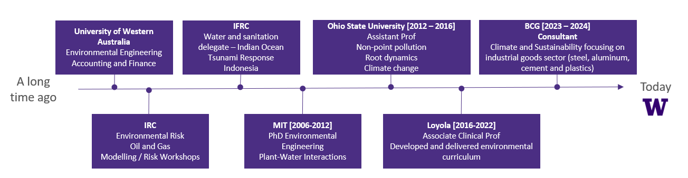

--- 
title: "Model Your World: Introduction to Modeling and Simulation"
author: "Gaj Sivandran"
date: "`r Sys.Date()`"
site: bookdown::bookdown_site
output: bookdown::gitbook
documentclass: book     
bibliography: [book.bib]  
biblio-style: apalike
link-citations: yes
github-repo: rstudio/bookdown-demo
description: "A textbook companion to the Univeristy of Washington QSci 497 class"
---

# Welcome

## Teaching Team Introductions Gaj Sivandran

**Teaching Interests**

- Design (freshman and senior)
- Fundamental engineering (statics, fluids)
- Environmental labs
- Water resources

**Research Interests**

- Climate change
- Active learning pedagogy
- Simulation modeling
- Decision support (socio-economic modelling) 

**Random Facts**

- I have an 11yr old daughter that helps me write exam questions
- Dogs >Cats, Cricket > Baseball,  AFL > NFL, Vegemite > Peanut butter 
- I like to run very very long distances, stilling working on why

## Course Highlights

This is the first offering of this course - what does that mean?

- I'm looking for your continuous feedback on what is working and what is not
- I'm going apply "Just-In-Time" teaching philosophy. What this essentially means is the course material is dynamic, if there is a need from the class to cover a topic - we can add it in
- Accessibility requirements for the Spring.

## What are the learning outcomes

By the end of the course, students will be able to:

- Explain the philosophy of modeling: abstraction, assumptions, and trade-offs.
- Use AI tools responsibly to support model design, coding, and analysis.
- Build and analyze basic mathematical and computational models (e.g., growth, predator–prey, carbon cycles).
- Implement simulation techniques in R, including discrete-event, continuous-time, and agent-based models.
- Explore the roles of uncertainty, sensitivity, and validation in modeling.
- Communicate modeling results clearly through visualizations, reports, and presentations.

:::promptbox
**Class Discussion**

Anything you want to add/remove/emphasize/de-emphasize?

            
:::

:::promptbox
**Class Discussion**

Lets find out why you all have decided to be here.
With the people around you, discuss why you are taking this class. We'll share back in 5mins.

             
:::

:::promptbox

**Class Discussion**

The way we code is changing rapidly right now with the development of LLMs. You might rightly ask "why do we need to know how to code?"

- Discuss it with the people at your table

*We are scientists! So it would be great to see arguments from all perspectives - play 'devil's advocate' its more fun if we don't all agree*

- What should our goal be in light of your discussion?

         
:::

One of my favorite education quotes:

*"We are currently preparing students for jobs that don't yet exist... using technologies that haven't been invented... in order to solve problems we don't even know are problems yet" - Richard Riley  U.S. Secretary of Education (1993-2001) *

## Notes and Textbooks
Quick Canvas tour

I am writing and publishing the textbook on the fly. To make sure you are working with the most up-to-date version hit refresh or close the tab from time to time.

## Course Topics
This being the first year – this is my ambitious list of topics – we’ll see how far we get (maybe further)

- Introduction to Modeling – abstraction, assumptions, model types.
- AI & Modeling Tools – using LLMs to support coding and model design.
- Mathematical Models – parameters, functions, growth models.
- Difference Equations – discrete-time dynamics, feedback, stability.
- Differential Equations – continuous-time systems in ecology/environment.
- Simulation as a Tool – discrete-event and continuous-time simulation.
- Uncertainty & Sensitivity – calibration, robustness, validation.
- Spatial & Agent-Based Models – individuals and space in systems.
- Communicating Models – visualization, ethics, limits.
- Capstone Showcase – final project presentations.

:::promptbox
**Class Discussion**

Anything you want to add/remove/emphasize/de-emphasize?

            
:::

## Classroom Etiquette

{fig.alt='Decorative' style="float:right; width:250px; margin:10px;"}

- Please feel free to bring your breakfast/lunch to class – just be sure to clean up before you leave
- Bring whatever tech you need to take notes and engage. 
- We will code in class so setting up R Studio is a good idea
- Ask questions – but please be respectful of all voices and views - wrong answers have more value than right ones!

:::promptbox
**Norms - Class Discussion**

Lets come up with a set of rules and expectations for this class and then lets agree to follow them.
             

:::

## Assessment

My goal with the assessments is to encourage you to put energy in the right places. 
I do not want to create busy work in this class.
But - At the same time - sometimes having a due date forces us to do the things that are good for us, but not as much fun.

:::promptbox
**Class Discussion**

Right now the assessment breakdown is:

- Homework & Labs (40%) – Weekly assignments and lab reports where students build, test, and reflect on models.
- Final Project (40%) – Develop and present a model of a real-world environmental system (individual or group). Includes a written report and in-class presentation.
- Participation & Preparation (20%) – In-class activities, peer feedback, and engagement in discussions.

**What should the project be worth?**

Here are the basics

**Milestone 1: Proposal & Scoping (Week 3)**

-	Topic idea (1–2 paragraphs)
-	Research question(s)
-	Initial model concept (sketch or description)
-	Deliverable: 1–2 page written proposal + brief in-class discussion

**Milestone 2: Background & Model Design (Week 5)**

-	Short background review (1–2 pages, with at least 3–5 references)
-	Model framework (diagram of variables, flows, assumptions)
-	Plan for methods (what kind of model and why)
-	Deliverable: Background report + 3–5 minute pitch with peer Q&A

**Milestone 3: Prototype Model (Week 7)**

-	First working version of your model in R
-	At least one test run with outputs
-	1-page reflection on challenges and next steps
-	Deliverable: Code + reflection memo

**Milestone 4: Model Refinement & Analysis (Week 9)**

-	Improved and more complete model
-	Sensitivity tests, scenario comparisons, or uncertainty analysis
-	At least 2–3 polished visualizations
-	Deliverable: Draft results section (1–2 pages) with figures

**Milestone 5: Final Report & Showcase (Week 10)**

-	Final written report (6–8 pages, including intro, methods, results, discussion, references, and code appendix)
-	A poster of your work – we’ll have our own digital poster session at the end of this course.
-	Deliverable: Report + poster presentation

**Grading**

- Detailed rubrics will be provided for each milestone.
- For Milestones 1 through 4, you will be given the opportunity to address feedback to earn back any points lost during the first submission. 

The project grade will be broken down as follows:

-	Proposal & Scoping: 10%
-	Background & Model Design: 15%
-	Prototype Model: 15%
-	Refinement & Analysis: 20%
-	Final Report & Presentation: 40%

> Being an elective, it means you all have different levels of preparation for this course. Grades will focus on your growth rather than comparisons to other students.

**Admin**

Every Friday will be project work. Either setting the groundwork for your project or delivering a milestone.
This Friday - come with a rough idea of what system you'd like to model/simulate. We'll use the class time to workshop the idea. There will be a graded Canvas discussion board where you will need to drop your idea into.

:::

